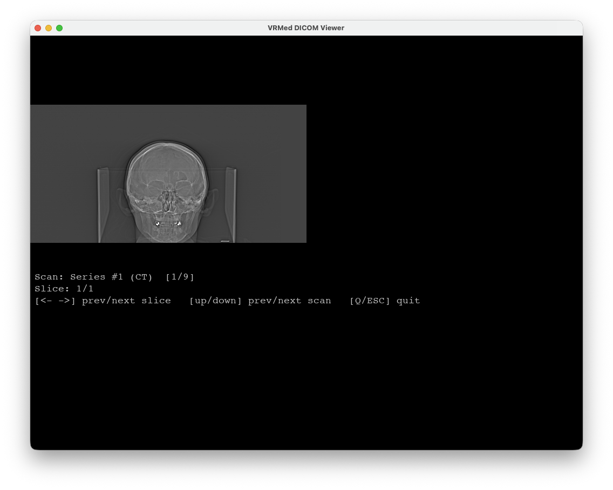

# VRMed Viewer

Desktopowa przeglądarka obrazów tomografii komputerowej (DICOM) z obsługą masek segmentacyjnych (NRRD). Aplikacja renderuje przekroje w oknie `pygame` i pozwala na obsługę z klawiatury oraz głosem w języku polskim (rozpoznawanie mowy offline).



## Instrukcja użytkowania

```bash
uv sync
uv run main.py --dataset "Zatoki 1"
```

## Stos technologiczny

Python 3.12+, `pygame`, `pydicom`, `pynrrd`, `numpy`, `sounddevice`, `vosk`. Zależności zarządzane przez `uv`.

## Architektura

Projekt stosuje prosty wariant wzorca MVC z jednokierunkowymi zależnościami między warstwami:

- **Repositories** – odczyt danych z dysku i budowa obiektów domenowych (`DicomRepository`, `NrrdRepository`).
- **Models** – czyste dataclassy reprezentujące badanie, serię, przekrój i maskę.
- **Controller** – `ViewerController` utrzymuje cały stan interfejsu (wybrany skan i przekrój, zoom, przesunięcie, jasność i kontrast, widoczność masek, historia cofnięć) i reaguje na akcje.
- **View** – `PygameView` jest bezstanowy; otrzymuje wszystkie parametry w pojedynczym wywołaniu renderu i rysuje klatkę wraz z panelem informacyjnym.
- **Input handlers** – wymienne źródła sterowania implementujące wspólny interfejs `SteeringHandler`; każdy generuje strumień akcji (`ViewerAction`). Dodanie kolejnego kanału nie wymaga zmian w kontrolerze.

## Struktura katalogów

```
main.py                          punkt wejścia
data/<dataset>/                  DICOMDIR + opcjonalne pliki <series>.nrrd
models/                          model Vosk (pobierany automatycznie)
src/
  controllers/                   logika viewera
  views/                         renderer pygame
  input/                         klawiatura i głos
  models/                        model domenowy
  repositories/                  wczytywanie DICOM i NRRD
  utils/                         windowing i konwersja pikseli
```

## Przepływ uruchomienia

1. `main.py --dataset "<nazwa>"` wskazuje katalog z plikiem `DICOMDIR`.
2. Wczytywane są wszystkie serie CT, sortowane przekroje i rozpoznawana jest płaszczyzna anatomiczna każdej serii.
3. Dla każdego pliku `<numer_serii>.nrrd` w katalogu zestawu dopinana jest maska segmentacyjna.
4. Uruchamiana jest główna pętla `ViewerController`, która pobiera zdarzenia, konwertuje je na akcje i aktualizuje widok (60 FPS).

## Funkcje

- Nawigacja po seriach i przekrojach.
- Zmiana płaszczyzny anatomicznej (osiowa, czołowa, strzałkowa) z automatycznym wyborem odpowiedniej serii wolumetrycznej.
- Zoom, przesunięcie, regulacja jasności i kontrastu (nakładane na parametry windowingu z DICOM).
- Warstwa masek segmentacyjnych z kolorowaniem etykiet.
- Cofanie i powtarzanie ostatniej akcji.
- Sterowanie klawiaturą oraz głosem w języku polskim, z obsługą liczebników (np. skok do wskazanego przekroju).

## Instalacja

Projekt używa menadżera pakietów `uv` zamiast `pip` czy `poetry`, ponieważ `uv` jest już praktycznie standardowym dla Pythona.
Zainstaluj go zgodnie z instrukcjami na [stronie](https://docs.astral.sh/uv/).

```bash
uv sync
```

## Dane

Dane wrzucamy do katalogu `data/`, np.:

```
data/
  Zatoki 1/
    DICOMDIR
    DICOM/
      ...
```

## Uruchomienie

```bash
uv run main.py --dataset "Zatoki 1"
```

## Autorzy
- Paweł Grzywa
- Hubert Piechura
- Sonia Stanula
- Ewa Kumórkiewicz
- Piotr Dusza
- Mateusz Woźniak
